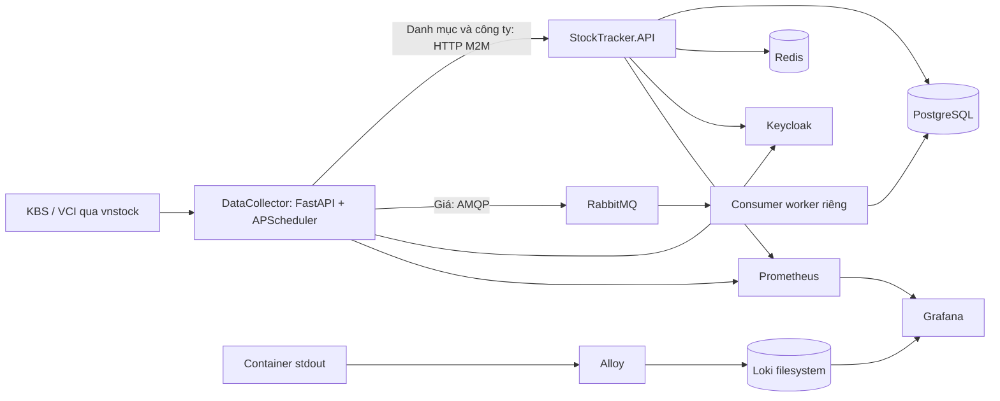
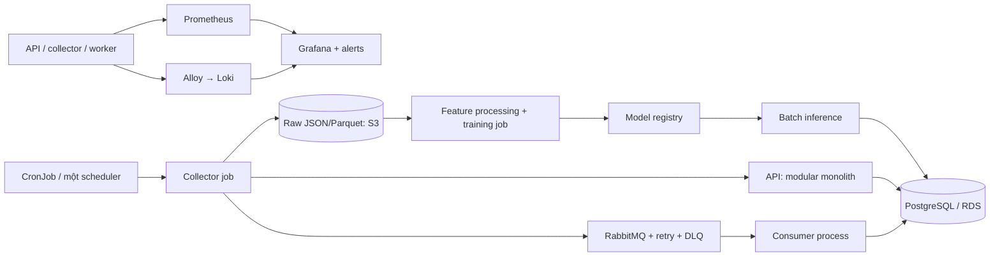

# Rà soát kiến trúc StockTracker

Ngày kiểm tra ban đầu: **27/08/2026**. Cập nhật khắc phục: **29/08/2026**. Phạm vi: ba checkout API, DataCollector và Deployment. Không ghi dữ liệu thật và không triển khai AWS.

### Trạng thái sau khắc phục

Các lỗi có thể sửa và kiểm thử trong repository đã được xử lý: sync catalog chạy qua domain service; composition/industry links được reconcile; service token kiểm tra issuer/audience/role; transaction lồng chỉ điều khiển savepoint; consumer có retry hữu hạn, DLQ và tiến trình worker riêng; news/events giữ lịch sử; intraday bắt buộc source ID; `/run/*` dùng Keycloak introspection, background job và khóa pipeline; Jenkins dùng JCasC + Docker daemon cô lập; staging chỉ dùng compose base, chờ health, migration rồi smoke/rollback; Prometheus/exporters/alerts/dashboard, Loki retention và logical backup đã được thêm.

Các giới hạn còn lại cần hạ tầng thật để hoàn tất: TLS/hostname và secret manager cho production; object storage cho Loki; PITR/WAL archive và restore drill trên môi trường riêng; distributed job state/lock khi chạy nhiều collector replica; raw archive/watermark; load test và kiểm thử container vì Docker daemon không khả dụng trong phiên này.

## 1. Kết luận

**Có nền tảng tốt để mở rộng tính năng; chưa đủ điều kiện vận hành production hoặc scale nhiều replica.** Không cần viết lại hay chia mỗi module thành microservice. Nên giữ API dạng modular monolith, tách tiến trình thu thập, consumer và các job ML theo vòng đời vận hành.

Điểm tốt: API chia domain/application/infrastructure, async SQLModel/PostgreSQL, Alembic, Keycloak, Redis có circuit breaker; collector có source/processor/sink; giá có unique key và database upsert; Dockerfile nhiều stage chạy non-root; đã có Jenkins và Alloy → Loki → Grafana.

Luồng thực tế không phải toàn bộ dữ liệu đi qua HTTP API: dữ liệu giá đi thẳng RabbitMQ rồi consumer thuộc API ghi database.

## 2. Các phát hiện cần ưu tiên

P1: nên xử lý trước khi tin vào dữ liệu hoặc mở dịch vụ. P2: cần trước scale/production. Đây là phát hiện từ code và cấu hình, không phải kết quả load test.

| Mức | Phát hiện và bằng chứng | Hành động đề xuất |
|---|---|---|
| P1 | `API/app/modules/market_index/api/market_index_router.py:sync_market_indices` đọc/gán `existing.stock_ids`, nhưng `MarketIndexEntity` chỉ có `stocks`. Nhánh tạo mới không ghi bảng `index_composition`. Có thể tạo chỉ số không có thành phần, rồi lỗi khi chạy lại. | Đưa sync vào application service, dùng repository thành phần và tính delta; test tạo mới, chạy lại, thêm/bớt thành phần. |
| P1 | Sync ngành/cổ phiếu/chỉ số viết trực tiếp repository trong router, tự mở session. `stock_router.py` chỉ cập nhật name/short_name cho cổ phiếu đã tồn tại; quan hệ ngành mới chỉ được ghi ở nhánh tạo. | Dùng service/TransactionManager và bulk upsert theo natural key; kiểm thử cập nhật exchange/type/industry; không dùng N truy vấn cho N mã. |
| P1 | `API/app/common/base_consumer.py` dùng `message.process(requeue=True)` cho mọi lỗi. JSON lỗi bị context reject trước, rồi nhánh except lại gọi reject. Validation lỗi có thể lặp vô hạn, không có DLQ/backoff giới hạn. | Một nơi duy nhất ACK/NACK; poison message → DLQ; retry có số lần và delay; test invalid JSON, invalid enum, DB timeout và redelivery. |
| P1 | `DataCollector/app/main.py` có `/run/*` không xác thực, chạy job dài trong request, không có khóa job chung giữa request và scheduler. | Không public port; thêm M2M authorization, job ID + trả 202, trạng thái job bền vững; khóa theo pipeline; khi dùng CronJob tắt scheduler trong web service. |
| P1 | `Deployment/docker-compose.jenkins.yml`: Jenkins controller chạy root, mount Docker socket, tắt setup wizard nhưng chưa có JCasC/init script tạo admin. Env `JENKINS_ADMIN_*` không tự cấu hình user trong image stock. | Bootstrap bảo mật rõ ràng; agent riêng có Python/uv/Docker CLI; cài plugin từ danh sách; controller không chạy build. Không coi socket `:ro` là ranh giới bảo mật. |
| P1 | `Deployment/jenkins/Jenkinsfile`: staging dùng `docker compose` không chỉ định `-f`, nên tự nhận dev override (`--reload`, bind mount, log JSON tắt, thêm host ports). Migration `--no-deps` chạy sau `up -d` nhưng chưa đợi PostgreSQL healthy. Bind mount nằm trong filesystem Jenkins container có thể không tương ứng host Docker daemon. | Staging chỉ dùng `-f docker-compose.yml`; chờ dependency healthy trước migration; deploy image đã push bằng tag bất biến; smoke test/rollback sau rollout. |
| P2 | `Deployment/services/*/.dockerignore` không nằm ở build context root, cũng không tên `Dockerfile.dockerignore`. Vì vậy chúng không được áp dụng như đang kỳ vọng. | Dùng Dockerfile-specific ignore hoặc `.dockerignore` tại từng context root. Hiện Dockerfile COPY chọn lọc nên chưa chứng minh secret có trong runtime image, nhưng context có thể chứa `.env`, `.git`, `.venv`. [Docker docs](https://docs.docker.com/build/concepts/context/#dockerignore-files). |
| P2 | `API/app/main.py` khởi động consumer trong lifespan của từng Uvicorn worker; image API chạy 2 workers. Tăng HTTP replica cũng tăng consumer và pool DB. | Tách entrypoint worker, vẫn dùng cùng image/code. Tính ngân sách connection = replicas × processes × (pool_size + overflow), cộng worker và migration. |
| P2 | Scheduler và rate limiter ở bộ nhớ process. Giờ cron trước sửa phụ thuộc timezone máy. Mỗi replica có quota/job riêng; restart không có checkpoint. | Phiên này đã đặt timezone Việt Nam, max_instances/coalesce trong một scheduler. Tiếp theo dùng CronJob `concurrencyPolicy: Forbid` hoặc scheduler có distributed lock; lưu watermark theo source/symbol/interval. |
| P2 | `/health` của API và collector chỉ trả `ok`. Không kiểm tra DB, broker hay mức độ sẵn sàng nhận việc. | Tách liveness/readiness; liveness không phụ thuộc upstream công cộng; readiness kiểm tra phụ thuộc bắt buộc và khởi tạo consumer. |
| P2 | Có logs nhưng chưa có Prometheus/metrics, alert rules, dashboard tuổi dữ liệu hoặc queue lag. Alloy hardcode project `stocktracker`; thay tên môi trường có thể mất log. | Thêm Prometheus, application metrics, RabbitMQ/Postgres exporters; low-cardinality labels; cảnh báo lần sync thành công cuối, rejected rows, DLQ, queue age, DB pool. |
| P2 | Loki bật compactor retention nhưng chưa có `limits_config.retention_period`; filesystem local, replication 1. `reject_old_samples_max_age` không phải retention. | Chọn retention rõ ràng, giới hạn đĩa, backup/restore; dùng object storage khi lên AWS. [Loki retention](https://grafana.com/docs/loki/latest/operations/storage/retention/). |
| P2 | Compose dùng Keycloak `start-dev`, HTTP, sample credentials; các service dữ liệu cùng host và volumes, không có backup/PITR/restore drill. | Chỉ dùng cho lab. Tách secrets theo môi trường, TLS/ingress, least privilege, backup + kiểm tra khôi phục. Startup realm import không phải cơ chế đồng bộ cấu hình realm đã tồn tại. |
| P2 | `require_service_account` chỉ kiểm tra IdentityPrincipal và realm role `system_admin`; tên hàm chưa chứng minh token thật sự thuộc service account. Chưa thấy kiểm tra issuer/audience/authorized client rõ ràng ở codec. | Xác minh claim validation của thư viện; role chuyên dụng `data_ingest`, kiểm tra issuer/audience/azp theo contract; test user token, client sai và token hết hạn. Không bỏ auth để làm test xanh. |
| P2 | `TransactionManager` commit/rollback cả session trong nhánh nested; có thể đóng transaction bên ngoài. Test có 42 RuntimeWarning do AsyncMock cho `in_transaction()`. | Kiểm thử transaction thật trên PostgreSQL; nested transaction chỉ điều khiển savepoint; dùng fake session đúng cho hàm đồng bộ. |

### Chất lượng và vòng đời dữ liệu

Đã sửa ở collector: khóa vnstock, API mới, mapping cột, stable IDs, dữ liệu thiếu không chuyển thành 0/ngày giả, snapshot lỗi không thành danh sách xóa, gửi message persistent, không báo thành công khi có operation lỗi. Chi tiết ở `StockTracker.DataCollector/docs/vnstock-4-migration.vi.md`.

Vẫn thiếu: raw archive, schema/source version trên dữ liệu lưu, watermark, data quality rules, retry/replay có kiểm soát, idempotency toàn tuyến và chính sách retention giá. Unique key giá hiện có là điểm khởi đầu, không chứng minh exactly-once. `data_source_id=NULL` trong dữ liệu intraday cũ không bảo đảm chống trùng; ID KBS được SDK tổng hợp có thể trùng giữa giao dịch cùng giây/giá/khối lượng.

Company endpoints có logic snapshot xóa phần không còn trong danh sách theo ID. News/events nguồn chỉ trả một cửa sổ/trang gần nhất: **không dùng contract snapshot đó để hứa lưu lịch sử tin tức đầy đủ**. Cần API upsert/append riêng cho sự kiện lịch sử, pagination/cursor và xóa chỉ khi snapshot có cờ hoàn tất. Không tự dọn bản ghi cũ chưa có ID trong phiên này.

## 3. Kiến trúc đích vừa sức cho dự án cá nhân

Đây là **đề xuất**, chưa được triển khai. Giữ RabbitMQ để học reliability; nếu chọn SQS khi lên AWS thì viết adapter và so sánh semantic delivery, không vận hành đồng thời hai broker chỉ để thêm công nghệ. Tập CKAD trên kind/k3d trước; EKS là lab sau vì có chi phí cluster và hạ tầng liên quan. Jenkins/Docker/Grafana/Loki là kỹ năng thực hành bổ trợ, không thay thế nội dung thi.

## 4. Lộ trình gắn với chứng chỉ

TA được hiểu là **Terraform Associate**; MLEA là **AWS Machine Learning Engineer – Associate**. Nếu bạn muốn chứng chỉ khác, cần chỉnh mapping này.

| Chặng | Bài thực hành trên StockTracker | Điều kiện hoàn thành |
|---|---|---|
| 1. Dữ liệu + backend | Chốt unit/timezone/source contracts; sửa index sync; DLQ; contract tests; PostgreSQL/RabbitMQ integration test; checkpoint và chạy lại một mã. | Sync hai lần không sinh bản ghi trùng; lỗi nguồn không xóa snapshot; message lỗi tới DLQ; database có đúng quan hệ index. |
| 2. Docker + Jenkins | Tách dev/staging; sửa ignore; cài agent tools; test → build → scan → push → migrate → deploy → smoke; tag theo SHA của cả ba repo. | Clone sạch chạy được; staging không mount code; lỗi test/migration chặn deploy; rollback image đã diễn tập. |
| 3. Observability | Prometheus + Grafana; Alloy/Loki; correlation/run IDs; alert dữ liệu trễ, DLQ và storage. | Cố tình làm hỏng source/broker và thấy alert hữu ích; log truy được theo run; retention hoạt động. |
| 4. SAA-C03 + Terraform | VPC/subnets/routes/security groups; IAM, ECR, S3, RDS backup/PITR; EC2/ECS lab trước hoặc EKS sau; TLS, KMS/secrets, budgets. Terraform modules, variables/outputs, provider lock, remote state, plan review/import/drift. | Tái tạo môi trường từ IaC; restore DB; không commit secrets/state; có sơ đồ HA/DR và giải thích tradeoff chi phí. |
| 5. CKAD | Deployment/Service/Ingress, ConfigMap/Secret, probes, requests/limits, securityContext, RBAC/NetworkPolicy, PVC, Job/CronJob, rollout/rollback và debug. | API và worker scale độc lập; CronJob không overlap; bad rollout không nhận traffic; sửa lỗi bằng kubectl trong thời gian giới hạn. |
| 6. MLEA | Raw → curated → feature; chia train/validation/test theo thời gian; baseline model; SageMaker processing/training/pipeline/registry; batch inference; monitor data/model drift. | Pipeline tái lập được với data/model version; không leakage tương lai; có metric so với baseline; triển khai lại/rollback model được. |

Không nên bắt đầu bằng mô hình dự đoán giá phức tạp. Một bài phát hiện dữ liệu bất thường hoặc dự báo biến động đơn giản giúp luyện trọn vòng đời ML mà vẫn dễ đánh giá. Kết quả chỉ phục vụ học tập, không phải tín hiệu giao dịch.

Nguồn phạm vi thi: [SAA](https://aws.amazon.com/certification/certified-solutions-architect-associate/), [Terraform Associate 004](https://developer.hashicorp.com/terraform/tutorials/certification-004/associate-study-004), [CKAD](https://www.cncf.io/training/certification/ckad/), [MLE Associate](https://aws.amazon.com/certification/certified-machine-learning-engineer-associate/).

**Lưu ý thời điểm:** trang AWS được kiểm tra ngày 27/08/2026 thông báo MLA-C02 mở đăng ký 01/09/2026; ngày cuối thi MLA-C01 tiếng Anh là 28/09/2026. Chọn tài liệu theo phiên bản và lịch thi thực tế, không mặc định học MLA-C01 dài hạn. [Thông báo chính thức AWS](https://aws.amazon.com/certification/certified-machine-learning-engineer-associate/).

## 5. Kết quả kiểm tra và giới hạn

- Collector baseline trước sửa: **63 passed**. Sau sửa: **126 passed**, Ruff lint/format đạt và Pyright 0 errors; contract test vnstock 4 được chạy, không skip.
- API sau sửa: **321 passed**, Ruff lint/format đạt và Pyright 0 errors. Các test service authorization đã được chuyển sang role `data_ingest`; test transaction, consumer/DLQ, sync quan hệ, health và metrics đều đạt.
- 16 file migration parse được bằng Python và Alembic chỉ có một head; chưa chạy upgrade trên PostgreSQL thật nên chưa chứng minh schema vận hành đúng.
- Docker Compose base validate được với `.env.example`; Docker Desktop Linux daemon không có pipe hoạt động. Chưa build image, chạy Jenkins, restore database hay test E2E qua broker thật.
- Source smoke thực tế trên FPT thành công ở 9 nhóm qua collector; kiểm tra riêng VN30 trả 30 thành phần; events KBS trả rỗng. Không khẳng định mọi mã, mọi index group, mọi ngày hoặc nguồn dự phòng đều hoạt động.
- Chưa có benchmark CPU/RAM, latency, throughput, recovery time hay ước tính chi phí AWS dựa trên workload đo được. Chỉ bật cloud sau khi đặt ngân sách và chọn quy mô lab.

**Việc nên làm tiếp theo:** chạy migration và integration test trên PostgreSQL/RabbitMQ thật, diễn tập backup/restore và Jenkins staging, sau đó bổ sung raw archive/watermark cùng distributed lock trước khi scale collector. Terraform hay EKS chỉ nên bắt đầu sau khi các kiểm tra vận hành này có thể lặp lại ổn định.
