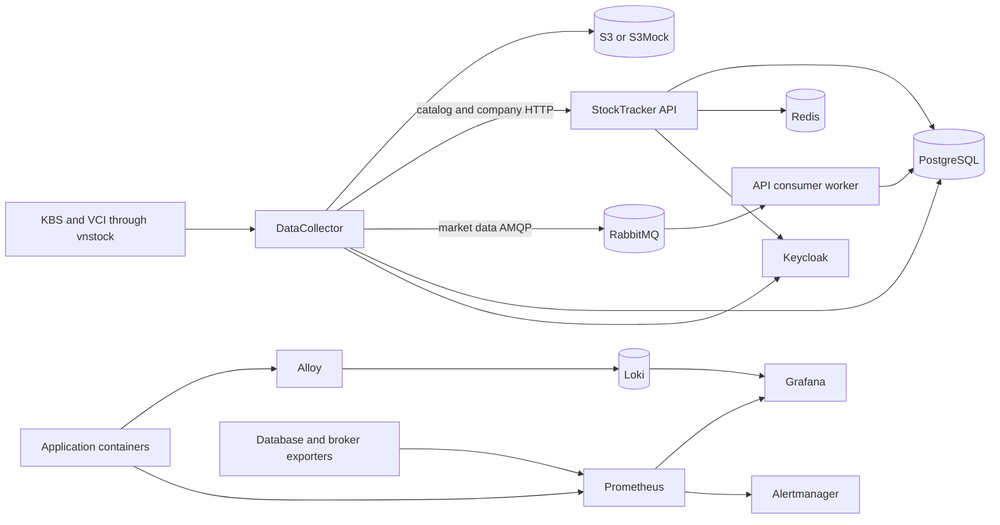

# StockTracker platform architecture

Last reviewed: 2026-08-30.

## Current design

The API remains a modular monolith. The collector and consumer worker are separate processes because they have different scaling, scheduling, failure, and connection-pool behavior. Market data does not pass through an HTTP API call; the collector publishes it to RabbitMQ and the worker persists it.

## Implemented foundation

- PostgreSQL persistence with separate API and collector Alembic version tables.
- Redis cache and authorization version invalidation with a circuit breaker.
- Keycloak machine-to-machine authentication and scoped ingestion roles.
- Short-lived context tokens with issuer, audience, expiration, and minimum HMAC key validation.
- Dedicated RabbitMQ worker, persistent messages, publisher confirms, delayed bounded retries, and dead-letter queues.
- Durable collector runs, steps, heartbeats, advisory locks, watermarks, resume, and raw object manifests.
- Immutable gzip raw archive in S3-compatible storage with SHA-256 replay verification.
- Liveness and dependency-aware readiness for both applications.
- Structured JSON logs, correlation IDs, Prometheus metrics, exporters, Grafana dashboards, Loki retention, and Alertmanager rules.
- Multi-stage non-root application images and an isolated E2E Compose project.
- Jenkins Configuration as Code, a separate Docker-in-Docker daemon, frozen dependency installs, static checks, dependency audit, tests, image builds, E2E, immutable build tags, staging migrations, smoke checks, and rollback.
- Scheduled logical PostgreSQL backups with archive validation and a guarded restore script.

## Reliability semantics

The system uses at-least-once delivery. Idempotent sinks, stable source IDs, natural-key constraints, and upserts protect repeated ingestion. It does not claim exactly-once processing. A process can stop after a sink commit and before step completion is recorded; resume can therefore repeat a completed external effect.

Collector advisory locks prevent duplicate pipelines across replicas, but APScheduler itself is in process. A production schedule belongs in EventBridge Scheduler, Kubernetes CronJob, or another durable orchestrator. RabbitMQ is retained as a reliability learning component; a future SQS adapter should compare delivery semantics rather than run two brokers without a requirement.

## Security model

All public host ports bind to loopback in the lab. Application images run as an unprivileged user. Secrets are injected from environment or Jenkins credentials and are not included in images. Authorization checks issuer, audience, authorized client, roles, and permission bitmaps.

The lab still uses Keycloak development mode and HTTP. Jenkins Docker-in-Docker is privileged by design and is a lab trust boundary, not a production isolation mechanism.

## Production gaps

- TLS ingress, stable DNS and OIDC issuer, managed secrets, key rotation, and least-privilege cloud IAM.
- Managed PostgreSQL with automated backup, PITR, restore drills, multi-AZ design, and connection sizing.
- Managed and encrypted object storage with versioning, lifecycle rules, access logging, and separate raw or Loki prefixes.
- Immutable image digests, vulnerability scanning, SBOM, signing, provenance, and admission policy.
- Durable scheduling, deployment orchestration, autoscaling limits, disruption budgets, and network policy.
- Load and chaos baselines for throughput, latency, CPU, memory, queue recovery, RPO, RTO, and cloud cost.
- Complete data-quality rules and an outbox or spool for the source-to-broker gap.

No microservice rewrite is required before these controls. The current boundaries are sufficient for certificate labs and incremental cloud migration.
