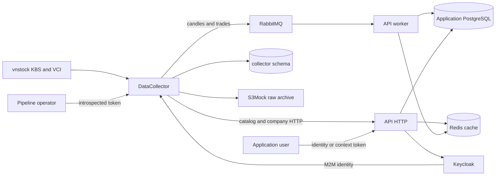
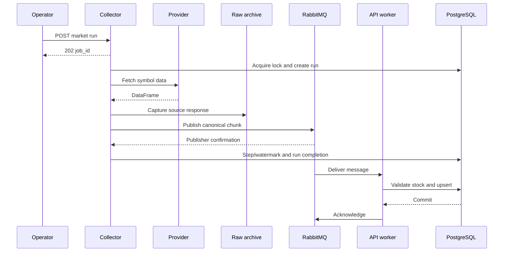

# System architecture and deployment flow

Reviewed 2026-09-05 from the three checked-out repositories. This is the implemented local Compose platform, not a production readiness certification.

## Ownership and topology

| Repository | Owns | Does not own |
| --- | --- | --- |
| API | Canonical entities/tables, REST contract, application roles/permissions, consumers, API Alembic history | Provider extraction, infrastructure manifests |
| DataCollector | SDK adapter, transformations, transport payloads, run/checkpoint/watermark state, raw archive, collector migrations | Canonical stock table writes |
| Deployment | Dockerfiles, Compose/environment translation, Keycloak import, monitoring, backup scripts, CI | Application business logic or migration definitions |

The same PostgreSQL instance hosts application tables, collector operational state, and a separate Keycloak database. API and collector migration histories are independent even when sharing the application database. Default schema version table belongs to API; collector.alembic_version belongs to collector.

## Services, networks, storage

Base manifest services and local host ports:

| Service | Role | Base host ports | Persistent volume |
| --- | --- | --- | --- |
| postgres | PostgreSQL 17 application/collector/identity databases | 5432 | postgres_data |
| redis | Cache/auth versions | 6379 | redis_data |
| rabbitmq | Durable routing, retries and DLQ; Prometheus plugin | 5672, 15672 | rabbitmq_data |
| keycloak | Realm/identity/M2M | 8080 | PostgreSQL database |
| api | HTTP application | 8000 | None |
| api-worker | Candle/trade consumers using API image | None | None |
| datacollector | Pipeline API and optional cron | 8001 | Control tables and archive |
| s3mock | Local S3-compatible raw object storage | 9092 -> 9090 | s3mock_data |
| postgres-backup | Optional periodic application dump | None; backup profile | postgres_backups |
| postgres-exporter | PostgreSQL metrics | Internal 9187 | None |
| redis-exporter | Redis metrics | Internal 9121 | None |
| prometheus | Scraping/rules, 15-day metric retention | 9091 -> 9090 | prometheus_data |
| alertmanager | Alert grouping/inhibition; no external receiver configured | 9093 | alertmanager_data |
| loki | Log storage | 3100 | loki_data |
| alloy | Opted-in Docker log discovery/forwarding | 12345 | alloy_data |
| grafana | Provisioned dashboards and data sources | 3000 | grafana_data |

Base published ports bind 127.0.0.1. The implicit development override changes some bindings [D01](review.md#d01). Backend services share the backend bridge. Prometheus/exporters/Alloy bridge into monitoring where needed; Grafana/Loki/Alertmanager use monitoring. Network and volume names derive from COMPOSE_PROJECT_NAME. Fixed container_name values prevent ordinary Compose replica scaling.

API and collector images use Python 3.12 slim, a builder with uv, frozen production dependency installation, and a non-root appuser runtime. Deployment context paths require sibling checkouts. The worker reuses the API image with `python -m app.worker`; it has no separate build definition or HTTP server.

## End-to-end runtime sequence

1. Initialize PostgreSQL on a new volume; its init script creates the separate Keycloak role/database. Init scripts do not rerun on an existing initialized volume.
2. Start infrastructure. Keycloak imports the supplied realm, including service clients and data_ingest/pipeline_operator roles.
3. Run collector migrations and API migrations explicitly. Neither HTTP entrypoint performs upgrades.
4. Start API HTTP, API worker and collector. Compose disables API HTTP consumers and enables the worker. The collector optionally initializes archive/control storage and scheduling.
5. Submit listing: industry catalog -> API ID lookup -> stocks -> API ID lookup -> index memberships.
6. Submit company collection: six per-stock operations delivered through HTTP. Three collections reconcile snapshots; event/news preserve absent history.
7. Submit market collection: history/trade chunks -> RabbitMQ -> API consumers -> PostgreSQL upsert -> acknowledgement.
8. Read canonical data via permission-protected API routes; recent bars may use Redis. Monitor collector statuses, worker logs, actual table contents and broker backlog separately.

Collector and consumer timing can interleave; the sequence highlights that run completion has no consumer persistence barrier. A completed collector run does not establish a complete dataset. The same run has no full-project transaction across services. In the shipped fresh database, the market persistence step currently fails because ORM enum types disagree with migrations (API A17). The runtime review observed valid messages reaching DLQ; the diagram's commit/ack sequence requires that blocker to be fixed.

## Identity and data boundaries

API verifies identity JWTs against configured Keycloak issuer/audience and issues separate context JWTs with scope/permission/version claims. Collector operator routes introspect Keycloak tokens and require pipeline_operator. Outbound collector HTTP calls use client credentials with data_ingest. Broker ingestion trusts access to the broker plus schema/domain validation.

Imported Keycloak realm roles do not seed API permission rows or user assignments. First-admin bootstrap is missing [A14](../../StockTracker.API/docs/review.md#a14). A browser token issued through localhost can have a different issuer from the API's internal keycloak URL; this path needs deliberate hostname configuration.

Application tables are documented in [API source reference](../../StockTracker.API/docs/reference.md). Provider conversion is documented in [collector provider contract](../../StockTracker.DataCollector/docs/provider-contract.md). Canonical units, adjustment policies, tenant browsing requirements and complete trade coverage are unresolved business decisions.

## Monitoring and recovery

Prometheus scrapes API, collector, PostgreSQL exporter, Redis exporter, RabbitMQ and itself. It does not scrape the separate worker. Application metrics are process-local counters and durations; collector success timestamps are not restored from durable run state. Queue-label and absent-freshness issues are [D03](review.md#d03) and [C04](../../StockTracker.DataCollector/docs/review.md#c04).

Alloy watches Docker containers and keeps only logging=true targets. It labels by container/Compose service/project and forwards to Loki. API/worker/collector and the backup service opt in. Grafana provisions dashboards and Loki/Prometheus data sources. Alertmanager groups alerts but has no configured external notification channel.

The backup profile writes compressed application database dumps to a local named volume, checks archive readability, and removes old dump files. It does not back up the separate Keycloak database or off-host state [D02](review.md#d02). Restore is a manually invoked destructive operation protected by RESTORE_CONFIRM. The review exercised a limited disposable application/collector database restore. Complete identity/archive recovery remains unimplemented.

## Jenkins flow

Jenkins checks out API/collector at the requested branch and Deployment through checkout scm. It runs lint/type/content/audit checks and tests, builds/tags images with source metadata, runs the data-foundation smoke, pushes images, then optionally deploys staging. SKIP_TESTS skips lint/unit/HTTP test stages but not the data-foundation stage. DEPLOY=false does not suppress image publication.

Staging starts infrastructure, migrates collector then API, and recreates application containers. An EXIT trap attempts application image rollback on failure by retagging previous images; it does not roll back database schema. Production deliberately raises an error.

The standalone Jenkins Compose uses a privileged Docker-in-Docker daemon, shared Jenkins workspace storage, and environment/credential IDs. Deployments target that configured daemon. It is not automatically a remote staging/production environment. See [operations](operations.md) for prerequisites and limitations.
